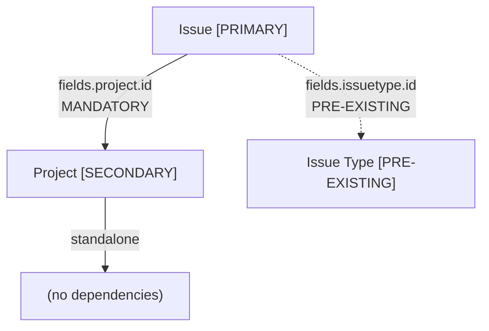

# Worked Examples

Agent-focused worked examples for `generate-connectivity-knowledge`. The research and OAS-generation steps walk through **Jira Cloud REST API v3** with the use case "Retrieve a Jira ticket and update its status." The validation steps walk through **Coda REST API** with the use case "List documents."

Read this file when you need concrete tables, structures, curl commands, and analysis each step should produce.

## Table of Contents

1. [Step 2: Documentation Discovery](#step-2-documentation-discovery)
2. [Step 3: Primary Endpoint Identification](#step-3-primary-endpoint-identification)
3. [Step 4: Primary Entity Extraction](#step-4-primary-entity-extraction)
4. [Step 5: CRUD Completion](#step-5-crud-completion)
5. [Step 6: Dependency Analysis](#step-6-dependency-analysis)
6. [Step 7: Secondary Entity CRUD](#step-7-secondary-entity-crud)
7. [Step 8: Action Plan](#step-8-action-plan)
8. [Step 9: Deep Research](#step-9-deep-research)
9. [Step 10: api-reference.md Consolidation](#step-10-api-referencemd-consolidation)
10. [Step 11: OpenAPI 3.0 Spec Generation](#step-11-openapi-30-spec-generation)
11. [Steps 12–13: Live Validation](#steps-1213-live-validation)
12. [Step 14: Final Report](#step-14-final-report)

---

## Step 2: Documentation Discovery

**Input:** `apiName = "jira"`

**Documentation sources found:**

| Source | URL | Type | Selected |
|---|---|---|---|
| Jira Cloud REST API v3 reference | `https://developer.atlassian.com/cloud/jira/platform/rest/v3/` | REST API reference | Yes — primary |
| Jira Cloud OpenAPI spec | `https://developer.atlassian.com/cloud/jira/platform/swagger-v3.v3.json` | OpenAPI 3.0 spec | Yes — schema source |
| Atlassian community forum | `https://community.atlassian.com/` | Community | No — not authoritative |

**Selection reasoning:** Prioritized the official REST API reference (human-readable endpoint docs) and the OpenAPI spec (machine-readable schemas with exact field types and required/optional markers).

---

## Step 3: Primary Endpoint Identification

**Use case:** "Retrieve a Jira ticket and update its status"

| Use Case Action | Method | Path | Path Parameters | Has Body | Content Type |
|---|---|---|---|---|---|
| Retrieve a ticket | GET | `/rest/api/3/issue/{issueIdOrKey}` | `issueIdOrKey` (string) | No | application/json |
| Update a ticket | PUT | `/rest/api/3/issue/{issueIdOrKey}` | `issueIdOrKey` (string) | Yes | application/json |

**Deviation note:** Updating "status" in Jira is not a direct PUT — it goes through the Transitions API. Add the transition endpoints as primary endpoints:

| Use Case Action | Method | Path | Path Parameters | Has Body | Content Type |
|---|---|---|---|---|---|
| Update ticket status (transition) | POST | `/rest/api/3/issue/{issueIdOrKey}/transitions` | `issueIdOrKey` (string) | Yes | application/json |
| List available transitions | GET | `/rest/api/3/issue/{issueIdOrKey}/transitions` | `issueIdOrKey` (string) | No | application/json |

The agent should record this deviation: "Updating status requires a transition, not a field update. Added the transitions endpoint as a primary endpoint."

---

## Step 4: Primary Entity Extraction

| Entity | Identifier Field | Alt Identifier | Role |
|---|---|---|---|
| Issue | `id` (string) | `key` (string, format: `PROJ-123`) | Primary |

The Issue entity has two identifier formats. The `id` is a numeric string (e.g., `"10001"`), the `key` is a human-readable format (e.g., `"PROJ-123"`). Both work in path parameters.

---

## Step 5: CRUD Completion

**Primary entity: Issue** — missing Create, Delete, List

| Operation | Method | Path | Path Parameters | Has Body | Lifecycle Purpose |
|---|---|---|---|---|---|
| Create | POST | `/rest/api/3/issue` | — | Yes | test-setup |
| Delete | DELETE | `/rest/api/3/issue/{issueIdOrKey}` | `issueIdOrKey` (string) | No | test-cleanup |
| List/Search | POST | `/rest/api/3/search` | — | Yes | test-validation |

Jira uses JQL (Jira Query Language) for searching issues. The List/Search endpoint accepts a JQL query in the request body, not simple query parameters. The Delete endpoint returns 204 No Content on success.

---

## Step 6: Dependency Analysis

### Mandatory Dependency Test for Issue

For each entity referenced by Issue, apply: **"Will the API return an error if I create an Issue WITHOUT providing a reference to this entity?"**

| Referenced Entity | Required Field | Required for Create? | Decision |
|---|---|---|---|
| **Project** | `fields.project.id` or `fields.project.key` | YES — API returns 400 without a project reference | **SECONDARY ENTITY** |
| **Issue Type** | `fields.issuetype.id` or `fields.issuetype.name` | YES — API returns 400 without an issue type | **PRE-EXISTING** — system-managed |
| User (assignee) | `fields.assignee.accountId` | NO — assignee is optional | **EXCLUDED** |
| Priority | `fields.priority.id` | NO — defaults to "Medium" | **EXCLUDED** |
| Label | `fields.labels[]` | NO — labels are optional | **EXCLUDED** |

### Recursive Dependency Walk

**Project** — apply the same test. Lead (User) is varies (some configurations require it, others default to the authenticated user) — EXCLUDED. Project Category is optional — EXCLUDED. Project can be created standalone. The dependency tree terminates here.

### Pre-existing Dependencies

| Entity | Why Pre-existing | Discovery Endpoint |
|---|---|---|
| Issue Type | System-managed, ships with default types (Bug, Task, Story, Epic) | GET `/rest/api/3/issuetype` |
| Priority | System-managed, defaults exist in every instance | GET `/rest/api/3/priority` |
| Status | System-managed, part of workflow configuration | GET `/rest/api/3/status` |

### Dependency Diagram



### Ordering

- **Creation order:** Discover Issue Type → Create Project → Create Issue
- **Deletion order:** Delete Issue → Delete Project (Issue Type is not deleted)

### Decisions Log

- **Included:** Project — mandatory parent, API returns 400 without `fields.project`.
- **Pre-existing:** Issue Type, Priority, Status — system-managed, tests discover valid values via List endpoints.
- **Excluded:** User (assignee), Label, Sprint — optional, Issue can be created without them.

---

## Step 7: Secondary Entity CRUD

**Secondary entity: Project**

| Operation | Method | Path | Path Parameters | Has Body | Lifecycle Purpose |
|---|---|---|---|---|---|
| Create | POST | `/rest/api/3/project` | — | Yes | test-setup |
| Read | GET | `/rest/api/3/project/{projectIdOrKey}` | `projectIdOrKey` (string) | No | — |
| Update | PUT | `/rest/api/3/project/{projectIdOrKey}` | `projectIdOrKey` (string) | Yes | — |
| Delete | DELETE | `/rest/api/3/project/{projectIdOrKey}` | `projectIdOrKey` (string) | No | test-cleanup |
| List/Search | GET | `/rest/api/3/project/search` | — | No | test-validation |

Project creation requires `key` (uppercase, max 10 chars, pattern `^[A-Z][A-Z0-9]+$`), `name`, `projectTypeKey` (e.g., `"software"`), and `leadAccountId`. Project deletion is a soft delete — the project moves to trash.

---

## Step 8: Action Plan

### 1. For Spec Generation (Step 11)

**Primary endpoint catalog:**

| Use Case Action | Method | Path | Path Parameters | Has Body | Content Type |
|---|---|---|---|---|---|
| Retrieve a ticket | GET | `/rest/api/3/issue/{issueIdOrKey}` | `issueIdOrKey` (string) | No | application/json |
| Update a ticket | PUT | `/rest/api/3/issue/{issueIdOrKey}` | `issueIdOrKey` (string) | Yes | application/json |
| Transition ticket status | POST | `/rest/api/3/issue/{issueIdOrKey}/transitions` | `issueIdOrKey` (string) | Yes | application/json |
| List available transitions | GET | `/rest/api/3/issue/{issueIdOrKey}/transitions` | `issueIdOrKey` (string) | No | application/json |

**Entities with identifiers:**

| Entity | Identifier | Type | Role |
|---|---|---|---|
| Issue | `id` / `key` | string / string (`PROJ-123`) | Primary |
| Project | `id` / `key` | string / string (`PROJ`) | Secondary |

### 2. For Live Validation (Steps 12–13)

**Full CRUD endpoint catalog:**

| Entity | Operation | Method | Path | Lifecycle Purpose | Source |
|---|---|---|---|---|---|
| Issue | Create | POST | `/rest/api/3/issue` | test-setup | CRUD completion |
| Issue | Read | GET | `/rest/api/3/issue/{issueIdOrKey}` | — | Use case |
| Issue | Update | PUT | `/rest/api/3/issue/{issueIdOrKey}` | — | Use case |
| Issue | Transition | POST | `/rest/api/3/issue/{issueIdOrKey}/transitions` | — | Use case |
| Issue | Delete | DELETE | `/rest/api/3/issue/{issueIdOrKey}` | test-cleanup | CRUD completion |
| Issue | List/Search | POST | `/rest/api/3/search` | test-validation | CRUD completion |
| Project | Create | POST | `/rest/api/3/project` | test-setup | Dependency CRUD |
| Project | Read | GET | `/rest/api/3/project/{projectIdOrKey}` | — | Dependency CRUD |
| Project | Update | PUT | `/rest/api/3/project/{projectIdOrKey}` | — | Dependency CRUD |
| Project | Delete | DELETE | `/rest/api/3/project/{projectIdOrKey}` | test-cleanup | Dependency CRUD |
| Project | List | GET | `/rest/api/3/project/search` | test-validation | Dependency CRUD |

- **Creation order:** Discover Issue Type → Create Project → Create Issue
- **Deletion order:** Delete Issue → Delete Project

**Pre-existing dependencies (discover, don't create):**

| Entity | Discovery Endpoint | Purpose |
|---|---|---|
| Issue Type | GET `/rest/api/3/issuetype` | Get valid `issuetype.id` for Issue creation |
| Priority | GET `/rest/api/3/priority` | Get valid `priority.id` |
| Status | GET `/rest/api/3/status` | Get valid status IDs for transition validation |

**Decision log:**

| Entity | Decision | Reasoning |
|---|---|---|
| Project | SECONDARY ENTITY | Mandatory parent — API returns 400 without `fields.project` |
| Issue Type | PRE-EXISTING | System-managed — discover via GET `/rest/api/3/issuetype` |
| Priority | PRE-EXISTING | System-managed — discover via GET `/rest/api/3/priority` |
| Status | PRE-EXISTING | System-managed — discover via GET `/rest/api/3/status` |
| User (assignee) | EXCLUDED | Optional — Issue can be created without an assignee |
| Label | EXCLUDED | Optional — Issue can exist without labels |
| Sprint | EXCLUDED | Optional — sprint assignment is not required |

### 3. For Credential Collection (Step 12)

- Type: **Basic auth** (email + API token)
- Header format: `Authorization: Basic base64(email:api_token)`
- Required credentials: `BASIC_USERNAME` (email), `BASIC_PASSWORD` (API token)
- Base URL pattern: `https://{your-domain}.atlassian.net`

### 4. Research Plan

- **Research order:** Project (secondary, bottom of tree) → Issue (primary)
- **Scope:** 2 entities + 3 pre-existing → 11 CRUD endpoints + 3 discovery endpoints
- **Excluded:** User, Label, Sprint, Component, Comment, Attachment

---

## Step 9: Deep Research

### API-Level Notes

**Auth Scheme:**
- **Type:** Basic authentication (email + API token)
- **Header format:** `Authorization: Basic base64({email}:{api_token})`
- **Required credentials:** `BASIC_USERNAME`, `BASIC_PASSWORD`
- **Base URL:** `https://{your-domain}.atlassian.net`

**Rate Limits:**
- **Global limits:** Token-bucket algorithm; varies by tenant and endpoint
- **429 behavior:** Returns `Retry-After` header in seconds; body contains error message
- **Retry strategy:** Respect `Retry-After`; if absent, exponential backoff starting at 1 second

### Pre-Existing Entity: Issue Type

**Discovery endpoint:** GET `/rest/api/3/issuetype` → 200

```json
[
  {
    "self": "string (URL)",
    "id": "string",
    "description": "string",
    "iconUrl": "string (URL)",
    "name": "string",
    "subtask": false,
    "hierarchyLevel": 0
  }
]
```

**Extract:** `id` (string) — use as `fields.issuetype.id` when creating an Issue.
**Common values:** Bug, Task, Story, Epic, Sub-task.

### Secondary Entity: Project

**Request schemas — Create POST `/rest/api/3/project`** (Content-Type: `application/json`):

Minimal request body:
```json
{
  "key": "PROJ",
  "name": "My Project",
  "projectTypeKey": "software",
  "leadAccountId": "5b10a2844c20165700ede21g"
}
```

**Response schemas — Read GET `/rest/api/3/project/{projectIdOrKey}` → 200:**
```json
{
  "self": "string (URL)",
  "id": "string",
  "key": "string",
  "name": "string",
  "description": "string",
  "lead": { "accountId": "string", "displayName": "string" },
  "projectTypeKey": "string",
  "assigneeType": "string",
  "url": "string"
}
```

**Field Catalog:**

| Field | Type | Required for | Constraints | Default |
|---|---|---|---|---|
| `key` | string | Create | uppercase, max 10 chars, `^[A-Z][A-Z0-9]+$` | — |
| `name` | string | Create | max 255 chars | — |
| `projectTypeKey` | enum | Create | `software`, `service_desk`, `business` | — |
| `leadAccountId` | string | Create | valid Atlassian account ID | — |
| `description` | string | — | — | `""` |
| `assigneeType` | enum | — | `PROJECT_LEAD`, `UNASSIGNED` | `PROJECT_LEAD` |

**Pagination — List GET `/rest/api/3/project/search`:**
- **Pagination type:** offset
- **Items field:** values
- **Offset param:** startAt
- **Initial offset value:** 0

**Side effects:**
- Delete behavior: soft delete — project is moved to trash; can be restored within 60 days.
- Cascade on delete: all issues within the project are also moved to trash.
- Immutable: `key`, `projectTypeKey` cannot be changed after creation.

### Primary Entity: Issue

**Request schema — Create POST `/rest/api/3/issue`** (minimal):
```json
{
  "fields": {
    "project": { "id": "10000" },
    "issuetype": { "id": "10001" },
    "summary": "Issue title"
  }
}
```

**Response schema — Read GET `/rest/api/3/issue/{issueIdOrKey}` → 200** (excerpt):
```json
{
  "id": "string",
  "key": "string",
  "fields": {
    "summary": "string",
    "status": { "id": "string", "name": "string" },
    "issuetype": { "id": "string", "name": "string" },
    "project": { "id": "string", "key": "string" },
    "assignee": { "accountId": "string" },
    "priority": { "id": "string", "name": "string" },
    "created": "string (datetime)",
    "updated": "string (datetime)"
  }
}
```

**Field catalog (excerpt):**

| Field | Type | Required for | Constraints | Default |
|---|---|---|---|---|
| `fields.summary` | string | Create | max 255 chars | — |
| `fields.project.id` | string | Create | valid project ID | — |
| `fields.issuetype.id` | string | Create | valid issue type ID (pre-existing) | — |
| `fields.description` | object (ADF) | — | Atlassian Document Format, not plain text | — |
| `transition.id` | string | Transition | valid transition ID from GET transitions | — |

**Pagination — Search POST `/rest/api/3/search`:**
- **Pagination type:** offset
- **Items field:** issues
- **Offset param:** startAt
- **Initial offset value:** 0

Note: Jira uses JQL passed in the request body, not query parameters.

**Side effects:**
- Delete behavior: hard delete (returns 204); use `deleteSubtasks=true` query param to delete sub-tasks.
- Immutable: `id`, `key` cannot be changed after creation.
- **Non-standard pattern:** Status changes CANNOT be done via PUT — must use the Transitions API. First GET available transitions, then POST with the chosen `transition.id`.

---

## Step 10: api-reference.md Consolidation

The agent reads `action-plan.md` (Step 8) and the deep research `api-reference.md` (Step 9) and writes the final consolidated `api-reference.md`. Heading levels demote by one as content moves under `## Entity Reference` — Step 9 used `### Project [SECONDARY]` with `#### Request Schemas`; Step 10 uses `#### Project [SECONDARY]` with `##### Request Schemas`. API-Level Notes from Step 9 are split into top-level `## Authentication` and `## Rate Limits & Constraints` sections — they do NOT appear again in Entity Reference.

The final file is self-contained: a downstream consumer reading only this file has auth details, rate limits, use case mapping, dependency graph with ordering, full CRUD catalog, and complete entity detail with all 6 categories.

---

## Step 11: OpenAPI 3.0 Spec Generation

Read the consolidated `api-reference.md` and produce `{PROJECT_FOLDER}/jira.yaml`. Example skeleton:

```yaml
openapi: 3.0.3
info:
  title: Jira Cloud REST API
  version: 1.0.0
  description: Manage Jira issues, projects, and transitions on the Atlassian Cloud platform.
servers:
  - url: https://{tenant}.atlassian.net/rest/api/3
    variables:
      tenant:
        default: example
paths:
  /issue/{issueIdOrKey}:
    get:
      operationId: getIssue
      description: Retrieve a Jira issue by ID or key.
      parameters:
        - name: issueIdOrKey
          in: path
          required: true
          schema: { type: string }
          description: Numeric ID or project-key format (e.g., PROJ-123).
      responses:
        '200':
          description: Issue retrieved successfully.
          content:
            application/json:
              schema: { $ref: '#/components/schemas/Issue' }
              example:
                id: "10001"
                key: "PROJ-123"
                fields:
                  summary: "Issue title"
                  status: { id: "10000", name: "Open" }
        '404':
          $ref: '#/components/responses/NotFound'
  /me:
    get:
      operationId: getCurrentUser
      description: Get the authenticated user — used as the connectivity-test endpoint.
      responses:
        '200': { $ref: '#/components/responses/Me' }
components:
  securitySchemes:
    basicAuth: { type: http, scheme: basic }
  schemas:
    Issue:
      type: object
      required: [id, key, fields]
      properties:
        id: { type: string, description: Numeric issue ID. }
        key: { type: string, description: Project-key format (e.g., PROJ-123). }
        fields:
          type: object
          properties:
            summary: { type: string, description: Issue title. }
            status:
              type: object
              properties:
                id: { type: string }
                name: { type: string, description: Status name (Open, In Progress, Done). }
security:
  - basicAuth: []
```

The spec generator MUST keep the API version (`/rest/api/3`) inside `servers[].url`, not in the path. The `/me` endpoint is the connectivity-test endpoint Step 12 will use to verify credentials before the full loop runs.

---

## Steps 12–13: Live Validation

Switching to the **Coda REST API** example (use case: "List documents") for clarity on the validation loop. The mechanics are identical for any other API.

### Step 12 — Prerequisites

`{PROJECT_FOLDER}` = `/workspace/connectivity-schema/coda/`. Spec file: `coda.yaml`. The agent reads:

1. `coda.yaml` — valid OpenAPI 3.0.3, 5 operations in `paths`. M = 5.
2. `api-reference.md` — Authentication section says: Bearer token, header format `Authorization: Bearer <TOKEN>`, credential key `CODA_API_TOKEN`.
3. `config.properties` — does NOT exist. Create it:

   ```bash
   printf '%s\n' 'CODA_API_TOKEN=your-coda-api-token-here' > /workspace/connectivity-schema/coda/config.properties
   ```

   Report and **WAIT**:

   ```
   Created config.properties with placeholder credentials:

     CODA_API_TOKEN=your-coda-api-token-here

   Please replace the placeholder value(s) with real credentials and let me know when ready.
   ```

   User confirms. Verify the key exists (without reading the value):

   ```bash
   grep -c '^CODA_API_TOKEN=' /workspace/connectivity-schema/coda/config.properties
   ```

   Result: `1` — proceed.

4. Base URL — Overview section says `https://coda.io/apis/v1`. Starts with `https://` — valid.

All four prerequisites pass. Proceed to Step 13.

### Step 13 — Validation Loop

**Enumerated operations:**

| # | Method | Path |
|---|--------|------|
| 1 | GET | /whoami |
| 2 | GET | /docs |
| 3 | POST | /docs |
| 4 | GET | /docs/{docId} |
| 5 | DELETE | /docs/{docId} |

**Entity IDs upfront:** `docId` (used by ops 4 and 5) → ask the user for an existing Doc ID. Store and reuse for all 5 operations that need it.

### Step 13.2 — example execution traces

#### Operation 1 — GET /whoami (passed)

Build curl with shell-substituted Bearer token:

```bash
curl -s -w "\n%{http_code}" -D /tmp/validation_headers.txt \
     -X GET "https://coda.io/apis/v1/whoami" \
     -H "Authorization: Bearer $(grep '^CODA_API_TOKEN=' /workspace/connectivity-schema/coda/config.properties | cut -d'=' -f2-)" \
     -H "Content-Type: application/json"
```

Status code = 200. `any_2xx_seen = true`. Compare response body fields against the spec schema for `User`. No mismatches. Classify as **passed**. Emit:

```
Validation: 1/5 | passed 1 | fixed 0 | failed 0
```

#### Operation 2 — GET /docs (fixed)

Curl returns 200 with body containing an `items` array. Spec's response schema for `DocList` declares the wrapper field as `documents`, not `items`. Auto-fix:

- Update `components/schemas/DocList.properties` to rename `documents` → `items` (or add `items` and remove `documents`, depending on the source).
- Write the updated spec to disk.

Re-execute the same curl. Response still 200, schema now matches. Classify as **fixed**. Emit:

```
Validation: 2/5 | passed 1 | fixed 1 | failed 0
```

#### Operation 3 — POST /docs (failed after Tier-3 remediation)

Curl returns 400 with body `{"statusCode": 400, "statusMessage": "title is required"}`. Tier 1 fix: add `title` to the request body. Re-execute. Returns 400 again with `{"statusCode": 400, "statusMessage": "folderId must be a valid folder reference"}` — **different** failure signature, progress made. Tier 2: read `api-reference.md` Entity Reference for Doc — confirms `folderId` is a required reference. Use the user's known folder ID. Re-execute. Returns 400 again with `{"statusCode": 400, "statusMessage": "tenant exceeded plan limits"}` — different signature, escalate to Tier 3. WebSearch finds Coda's plan-limit doc; this is a tenant restriction, not a spec bug. Classify as **failed** (3 attempts, all remediation tiers exhausted).

#### Operation 4 — GET /docs/{docId} (passed)

Substitute the upfront-collected `docId`. Curl returns 200, schema matches. Classify as **passed** (1 attempt).

#### Operation 5 — DELETE /docs/{docId} (skipped — destructive)

Before executing, the destructive-operation confirmation prompt fires:

```
⚠️  Destructive operation: DELETE /docs/{docId}
This will permanently delete the Doc with ID `AbCDeFGH`.
This action may not be reversible.

Proceed? (yes / skip)
```

User says "skip". Classify as **skipped**. Do NOT execute curl.

---

## Step 14: Final Report

```
Validation complete: 5/5 | passed 2 | fixed 1 | failed 1 | skipped 1

  ✔ GET /docs  fixed — DocList.documents → DocList.items: structural mismatch (rename)
  ✗ POST /docs  400 — tenant exceeded plan limits (3 attempts)
  ⏭ DELETE /docs/{docId}  skipped — user declined destructive operation
```

One operation failed. Present the four-option decision:

```
1 operation(s) could not be validated. How would you like to proceed?

1. Provide additional information so I can retry the failed operations
2. Keep the failed operations in the spec as-is (no changes to their definitions)
3. Remove the failed operations from the spec and proceed with the corrected spec
4. Cancel — stop the validation process
```

If the user picks **3 (Remove)**, the agent uses the Edit tool to delete the `paths./docs.post` entry from `coda.yaml` and writes the file. Then:

```
Knowledge ready: /workspace/connectivity-schema/coda/
  - api-reference.md
  - coda.yaml
  - config.properties
```

The caller (typically `build-mule-integration` Step 3a) reads this folder to inform HTTP-Connector configuration.
